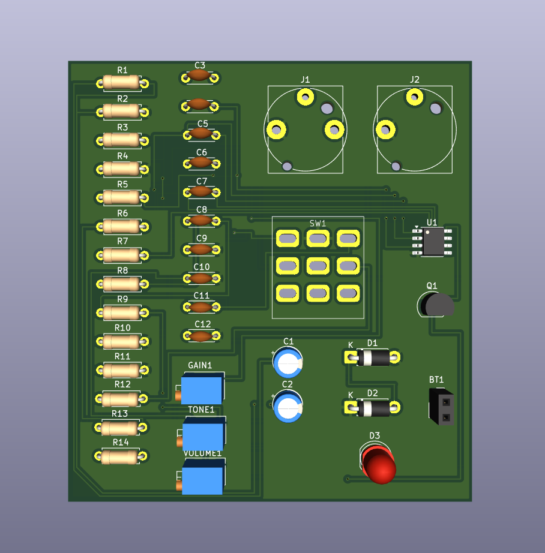
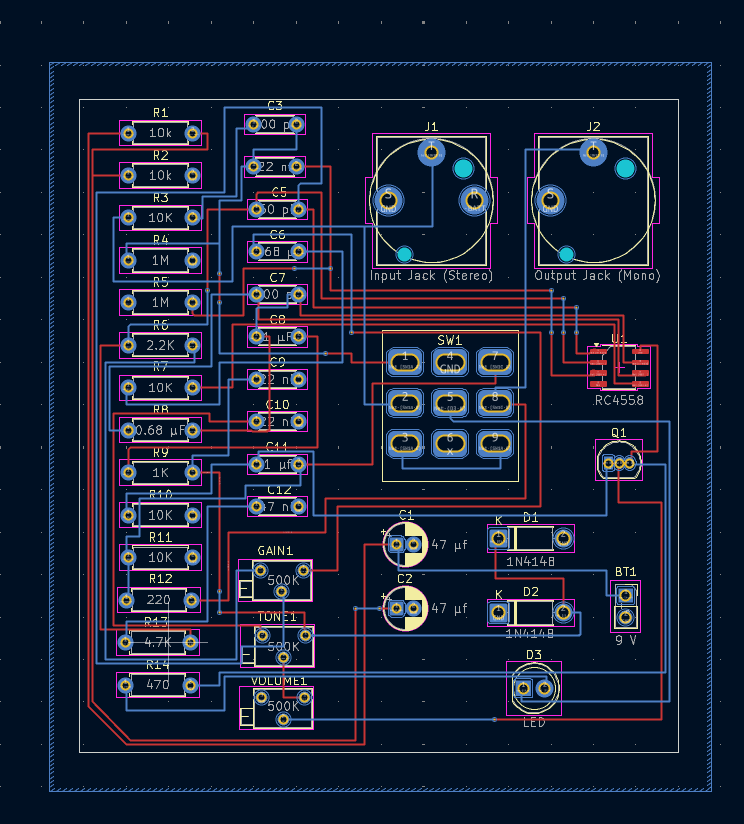

# guitar-distortion-effects-pedal
This is JUJUBE--a custom analog guitar distortion effects pedal using the RC4558 dual op-amp.
 
The circuit features:  
 
-3 potentiometers for user-adjustable gain, tone, and volume control  
 
-A 3PDT footswitch for true bypass switching, with integrated LED indicators for visual feedback  
 
-1N4148 silicon diodes configured for symmetrical clipping, creating a distinct, aggressive distortion tone  
 
-Built and tested on breadboard  -Includes CAD of enclosure with labeled knob controls, optimizing component layouts

## Schematic

## Enclosure

